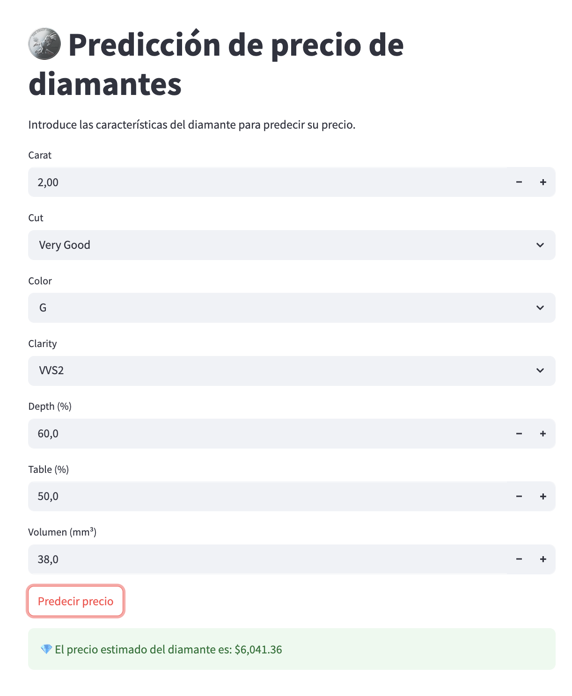

# Diamantes
Pequeño modelo de ML utilizado para estimar el precio de un diamante

> Demostración creada para el curso de Fundamentos de Machine Learning
> Prof. Jorge Anais Vilchez
> Abril 2025  

# Como hacerlo funcionar
1. Extraiga el archivo que contiene al modelo o genere uno nuevo a partir del jupyter notebook.
2. Cree un nuevo ambiente virtualm, instale los requisitos y ejecute la aplicación
```python
python -m venv venv
source venv/bin/activate
pip install -r requirements.txt
streamlit run app.py
```
3. Disfrutar

# Interfaz


